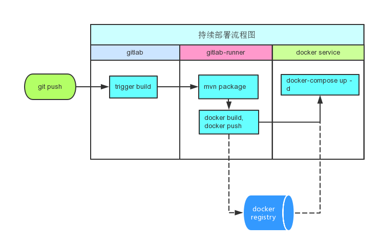
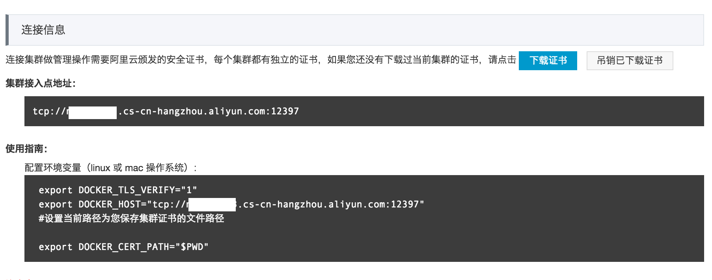


## 动机
一般从代码提交到版本部署要经历下面几个阶段:
<h4> `提交代码` >> `构建` >> `运行测试用例` >> `准备环境` >> `部署`</h4>
现在的软件开发越来越流行小团队和微服务, 一个小产品的开发团队往往只有两个后端开发, 但是可能维护着十来个服务. 每个服务的迭代开发非常快, 每天都会重复若干次上述过程, 特别是测试版本的部署更为频繁. 如何实现上述过程的自动化对于团队开发效率的提升非常重要.
我们往往把前三个步骤的自动化称为持续集成, 后两个步骤的自动化称为持续部署. 本文介绍如何基于 gitlab 和阿里云容器服务打造完全自动化的持续集成和持续部署流水线. 这也是我们公司(亿保健康)目前采用的流水线.

## 总体部署流程图


该流水线主要由四个服务构成:
- gitlab, 存放代码的地方.
- gitlab-runner, 构建服务器.
- docker service, 阿里云容器服务, 即容器集群, 用来部署容器实例.
- docker registry, docker 私有仓库, 存放 docker 镜像, 由[distribution](https://github.com/docker/distribution) 搭建.

该流水线的步骤如下:
1. 开发人员提交代码
2. gitlab服务器收到代码更新, 并通知 gitlab runner运行持续集成脚本.
3. gitlab runner 从gitlab 下载代码, 并运行持续集成脚本
4. 持续集成脚本主要由三部分组成
  + 针对 maven 项目, 运行打包和单元测试
  + build docker镜像,并上传到私有镜像仓库
  + 运行 docker-compose, 在阿里云容器服务集群上部署服务

## 示例项目
本文以一个 hello world的 spring boot 应用为例介绍如何实现上述流水线. 以下为该应用的目录结构.
```
├── .gitlab-ci.yml            # gitlab 持续集成脚本
├── docker
│   ├── Dockerfile            # 用来构建 docker 镜像
│   └── docker-compose.yml    # docker 服务编排文件, 用来把服务部署到阿里云容器集群上
├── pom.xml
├── scripts
│   └── deploy.sh             # 部署脚本, 驱动整个流水线
└── src
    ├── main
    │   └── java.ebao.hello
    │         └── BootApp.java  # 一个简单的 hello world 服务
    └── test
```

下面逐一介绍各部分.

## 1. scripts/deploy.sh
项目部署脚本, 很简单, 就给项目打一个 tag, 然后 push, 从而告诉 gitlab 可以开始整个自动部署流水线操作. 当然在部署前, 你需要把本地改动提交好.
```shell
version=$1
if [[ -z $1 ]]; then
	echo "请输入版本号, 如: 1.0"
	exit 1
fi

git tag $version
git push --tags
```

## 2. .gitlab-ci.yml
#### Gitlab CI
介绍`.gitlab-ci.yml`之前, 我们先介绍 Gitlab CI. Gitlab CI为 gitlab 的持续集成服务, 类似 jenkins, circle等持续集成工具(应该说跟circle更像).
在gitlab 8.0以前, Gitlab CI作为一个单独的服务存在, 8.0以后集成到 gitlab 中了, 但是构建任务还是运行在gitlab runner 机器上. 一个 gitlab 服务可以有多个 gitlab runner 运行在多台机器上.
Gitlab CI 的核心是文件`.gitlab-ci.yml`, 只要gitlab 项目的根目录存在这个文件, 这个项目就具备了 gitlab 提供的持续集成功能. 使用 Gitlab CI 有很多有点:
- 持续集成脚本和源码放在一块, 拥有版本管理功能, 并且和源码的版本一致.
- 脚本很容易学习, 对 git 的分支,版本,tag 等有非常好的支持.
- 部署简单, 不需要额外部署类似 jenkins 这种持续集成服务, 当然 gitlab runner 还是要部署的. 如果你的源码是由 gitlab 管理的, 持续集成采用 Gitlab CI 是最好的选择.

#### .gitlab-ci.yml
上面说过, 为了使用 gitlab-ci的持续集成功能, 只需要在 gitlab 项目根目录下增加一个文件即可: `.gitlab-ci.yml`. 该文件的具体格式可以参见官方文档. 我们这里的例子为

```yaml
variables:
  PROJECT_NAME: hello-ci
  IMAGE_NAME: registry.xxx.com/$PROJECT_NAME
  JAR_FILE: ${PROJECT_NAME}-${CI_BUILD_TAG}.jar

build:
  stage: deploy
  script:
    - mvn package -Dapp.version=$CI_BUILD_TAG  -Dartifact.id=$PROJECT_NAME # build and test the package
    - cp target/$JAR_FILE docker/app.jar
    - cd docker
    - docker build -t $IMAGE_NAME:$CI_BUILD_TAG . # build the docker image
    - docker push $IMAGE_NAME:$CI_BUILD_TAG         # push the image to the registry
    - docker-compose pull
    - docker-compose -p $PROJECT_NAME up -d  # start an application in 阿里云容器服务
  only:
    - tags
  tags:
    - shell
```

这里简单介绍下上面的yaml 文件

**第一部分: 变量定义**
```yaml
variables:
  PROJECT_NAME: hello-ci
  IMAGE_NAME: registry.xxx.com/$PROJECT_NAME
  JAR_FILE: ${PROJECT_NAME}-${CI_BUILD_TAG}.jar
```

刚开始variables部分是变量定义, 定义好的变量可以通过`$VarName`或者`${VarName}`引用, 另外Gitlab CI有些预定义的变量, 可以直接引用. 具体参考 http://docs.gitlab.com/ce/ci/variables/README.html

**第二部分: job 定义**

接下来为job 定义, 这里定义了一个名叫`build`的 job, 你可以取任意名字, 可以有任意多个job.
job 定义的几个关键field:
- `stage`, 表示该 job 属于哪个 stage, 默认 stage 为 test. 默认有三个stage: build, test, deploy.
- `script`, 执行该 job 时运行的脚本, 为 job 定义的核心部分, 将会被运行在 shell 中.
- `tags`, 用来选择 gitlab-runner. 这里的值为 shell, 表示选择tag 为 shell 的 runner来运行该构建任务.
- `only`, 选择该job 什么时候需要启动. 这里的值为 tag, 表示只有通过 git tag打上标签的代码提交才会触发该任务.

**脚本部分**

注意脚本部分是在 gitlab runner 机器上运行的, 所以配置好 gitlab runner 非常重要, 这个我们下部分再讲.
这里的脚本主要做三件事, 注释中也写明了:
+ 针对 maven 项目, 运行打包和单元测试
+ 把打包后的 jar 包拷贝到 docker 目录, 并命名为 app.jar, 然后build docker镜像,并上传到私有镜像仓库
+ 运行 docker-compose, 在阿里云容器服务集群上部署服务

## 3. docker/Dockerfile
```
FROM java:8-jre
MAINTAINER Ye Qinyong "yeqinyong@ebao.com"

ENV TZ=Asia/Shanghai
RUN ln -snf /usr/share/zoneinfo/$TZ /etc/localtime && echo $TZ > /etc/timezone

ADD * /usr/local/

WORKDIR /usr/local/
CMD    ["java", "-jar", "app.jar"]
```

该文件用来 build docker 镜像, 主要有三部分:
- 集成自官方 java 镜像
- 设置中国时区
- 把 `java -jar app.jar` 设为启动命令

## 4. docker/docker-compose.yml
```yaml
hello-ci:
  image: $IMAGE_NAME:$CI_BUILD_TAG
  labels:
    aliyun.scale: '1'
    aliyun.routing.port_8080: 'http://hello-ci.yeqinyong.cn'
  restart: always
  environment:
    - reschedule:on-node-failure
```

该文件用来编排 docker 服务. 这里使用了变量`$IMAGE_NAME`和`$CI_BUILD_TAG`, 由于 docker-compose 是在`.gitlab-ci.yml` 上下文中运行的, 这些变量引用的就是`.gitlab-ci.yml`中定义的变量. `labels`下面定义的是阿里云容器服务专有属性, `aliyun.scale: '1'`表示启动一个容器实例, 在生产环境中, 我们会设置更高的数字, 以提高可用性和性能. aliyun.routing.port_8080: 'http://hello-ci.yeqinyong.cn' 表示把`hello-ci.yeqinyong.cn`域名解析到该容器的8080端口, 协议为 http. 这样当容器启动完毕后, 我们就可以通过域名http://hello-ci.yeqinyong.cn 访问服务了. 当然, 这里有一个前提, 你首先需要把该域名解析到容器集群的 IP 地址(在阿里云上, 往往是一个 slb 地址).

## 5. gitlab-runner的配置
上面说过, 以下脚本会在 gitlab-runner机器上运行, 所以首先我们需要配置好 gitlab-runner机器.

```yaml
script:
  - mvn package -Dapp.version=$CI_BUILD_TAG -Dartifact.id=$PROJECT_NAME # build the package
  - cp target/$JAR_FILE docker/app.jar
  - cd docker
  - docker build -t $IMAGE_NAME:$CI_BUILD_TAG . # build the docker image
  - docker push $IMAGE_NAME:$CI_BUILD_TAG         # push the image to the registry
  - docker-compose pull
  - docker-compose -p $PROJECT_NAME up -d # start an application in 阿里云容器服务
```

为了运行以上脚本我们需要安装: maven, docker, docker-compose

还要安装 gitlab-runner, 并做以下配置:
#### 注册一个 runner
```shell
gitlab-runner register --name shell --url http://your.gitlab.server/ci --registration-token <your-token> --executor shell
```

#### 添加阿里云容器集群证书
1. 进入阿里云容器服务管理界面: https://cs.console.aliyun.com, 选择一个集群, 点击管理,  点击`下载证书`, 并把证书解压到一个目录, 比如`/CertFiles`


2. 在 gitlab-runner上编辑/etc/gitlab-runner/config.toml
找到刚刚注册的`shell` runner,增加 `environment` 一项, `DOCKER_HOST`为上图中的集群接入地址, `DOCKER_CERT_PATH`为证书目录.

```
[[runners]]
  name = "shell"
  url = "http://your.gitlab.server/ci"
  token = "xxxxxxx"
  executor = "shell"
  environment = ["DOCKER_TLS_VERIFY=1", "DOCKER_HOST=tcp://xxxx.cs-cn-hangzhou.aliyun.com:12397", "DOCKER_CERT_PATH=/CertFiles", "LC_ALL=UTF-8"]
```  

有了以上配置, 当脚本在名为 `shell`的 runner上运行是, docker, docker-compose 连接的是阿里云的 容器集群而不是本地的 docker daemon.

## 结束
至此, 一条持续集成持续部署自动化流水线打造完毕. 如果我们在本地开发机器上的项目根目录下运行 `scripts/deploy 0.1-test`, 那么 gitlab 会自动开始运行一条流水线, 在 gitlab 相应页面上可以查看流水线的执行状态, 如下图. 一旦流水线执行完毕, 我们就可以在相应的 URL 访问服务.


## reference
- [.gitlab-ci.yml](http://docs.gitlab.com/ce/ci/yaml/README.html)
- [docker](https://docs.docker.com/engine/understanding-docker/)
- [docker-compose](https://docs.docker.com/compose/overview/)
- [阿里云容器服务](https://help.aliyun.com/product/9091095_25972.html?spm=5176.750001.2.3.MTQUpL)
